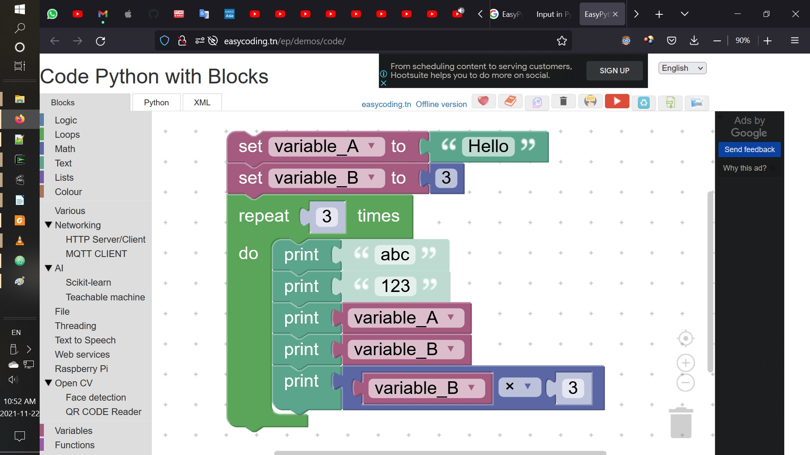
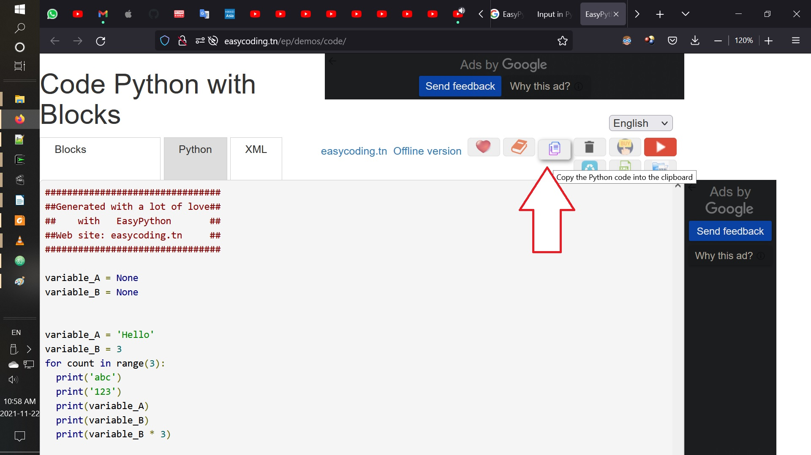
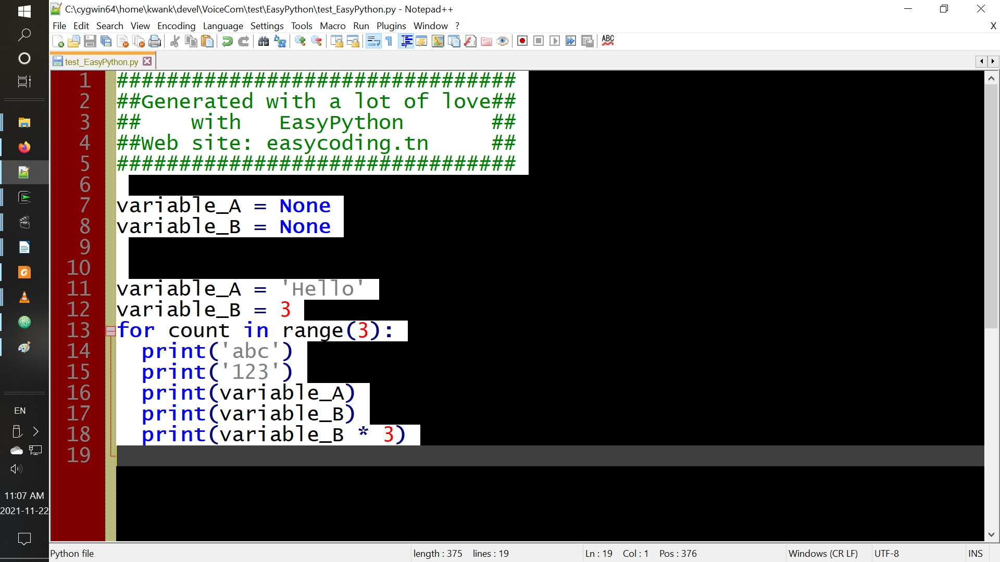
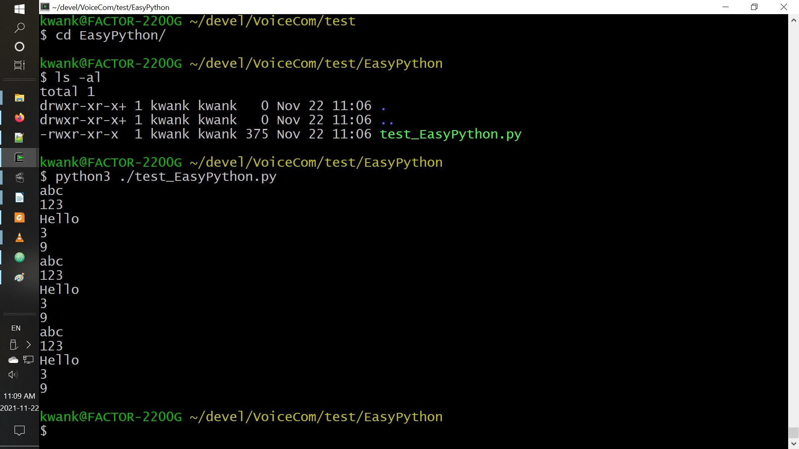

# README.md 20211122

  https://github.com/kwankunghkg/Robotics/tree/main/VoiceCom/test/EasyPython

==================================================

IoT@school by ADEL KASSAH 
1. EasyPython
2. Easy Raspberry Pi

==================================================

EasyPython - Code Python with Blocks 

  http://easycoding.tn/ep/demos/code/

EasyPython tutorial 

  https://www.youtube.com/playlist?list=PLfPtpZzK2Z_SNC0hcwtkS_XS1BaXX6lrt
  
1	6:41	Using variables
2	7:32	Basic INPUT OUTPUT operation
3	11:25	The If statement
4	8:17	The For loop
5	9:12	The While loop
6	7:05	File management
7	11:12	Multi-threading
8	4:48	Send an email
9	6:39	HTTP server
10	10:46	Text to speech TTS with pyttsx3
11	11:05	Easy AI with Python tutorial: Classification & Decision tree with Scikit-learn

==================================================

/ /
/ / Generated with a lot of love
/ /    with   EasyPython       
/ / Web site: easycoding.tn     
/ /

for count in range(3):
  print('abc')
  print('123')

==================================================

reference

Blocky
  https://github.com/google/blockly/wiki/Text#printing-text
Python 
  https://www.w3schools.com/python/python_operators.asp
  https://www.askpython.com/python/examples/colon-in-python
  http://easypythondocs.com/input.html

==================================================

==================================================

IoT@school - Control your game with an Android phone
  http://easycoding.tn/index.php/iot-school/project-1-control-your-game-with-an-android-phone/
  From the age of 10
Objects to be connected
  A sprite with an Android device
Connectivity
  WIFI
Software used 				
  Snap 4 Arduino
  MIT App Inventor
Hardware 
  A Computer
  An Android device

IOT@School Projet 1: Control your game with an Android phone
  ADEL KASSAH Aug 25, 2017
  how to control a Scratch sprite with your own Android phone
Video 1/3
  https://youtu.be/9Dq7G75nJhQ
Video 2/3
  https://youtu.be/yLtuCWPnDWw
Video 3/3	
  https://youtu.be/y2OPTOOQ7As

==================================================

Easy Raspberry Pi tutorial - ADEL KASSAH Jun 1, 2020
  https://www.youtube.com/playlist?list=PLfPtpZzK2Z_SjWektY24mHfUJi-4GLqMX
1	5:05	Setting up the envirment
2	4:39	First PYTHON program Hello World
3	4:16	Blinking LED
4	7:41	Take a photo and send an email
5	8:39	Control the Rpi with your Android APP
6	5:03	Get data from the Rpi with your Android APP
7	3:12	The relay
8	4:11	The temperature and humidity sensor (DHT11 DHT22)
9	9:55	Communication between 2 Raspberry Pi
10	4:31	The PIR (Motion) sensor
11	6:28	Send data to Thingspeak
12	5:26	Get Data from Thingspeak
13	3:10	The servo
14	4:29	The push button
15	12:13	Basic MQTT Operations
16	11:26	MQTT objects control

==================================================

==================================================
End of File
