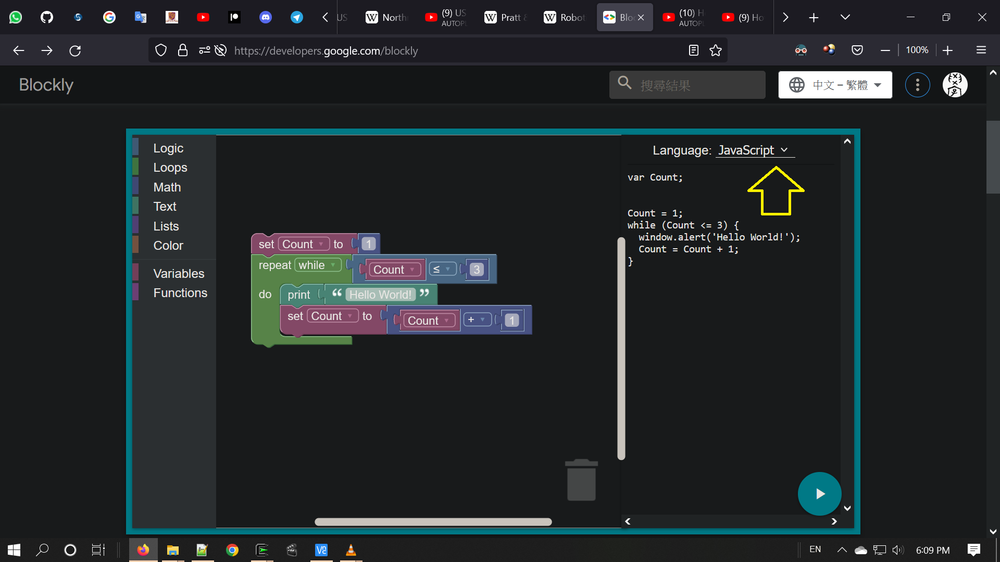
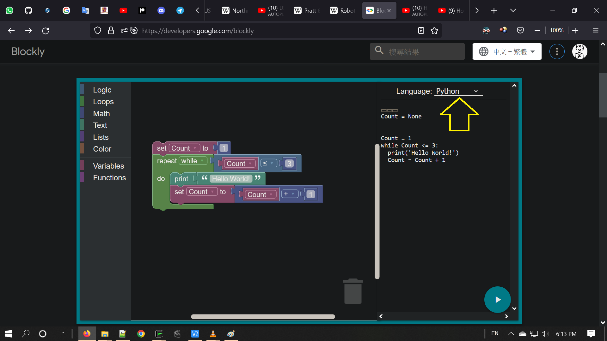
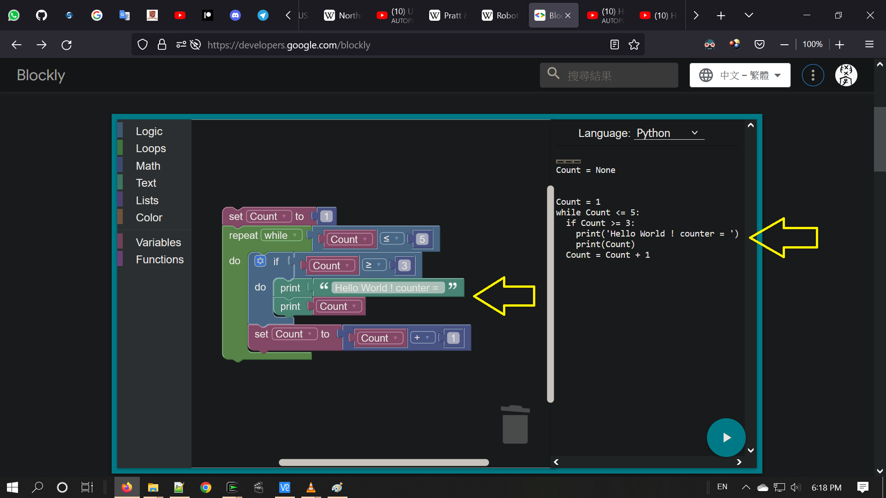
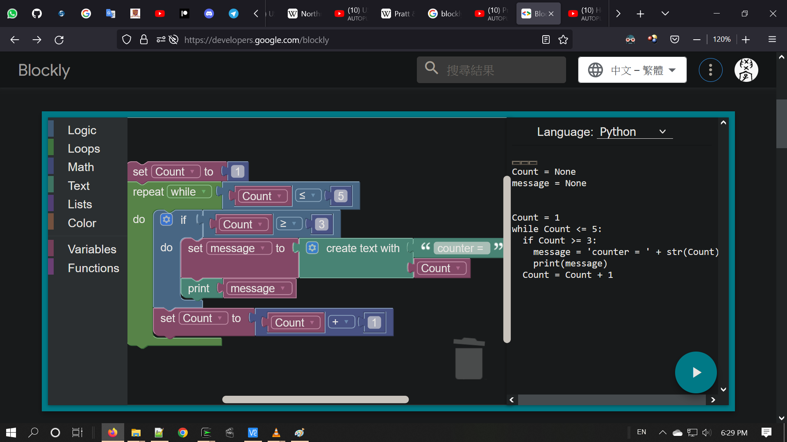
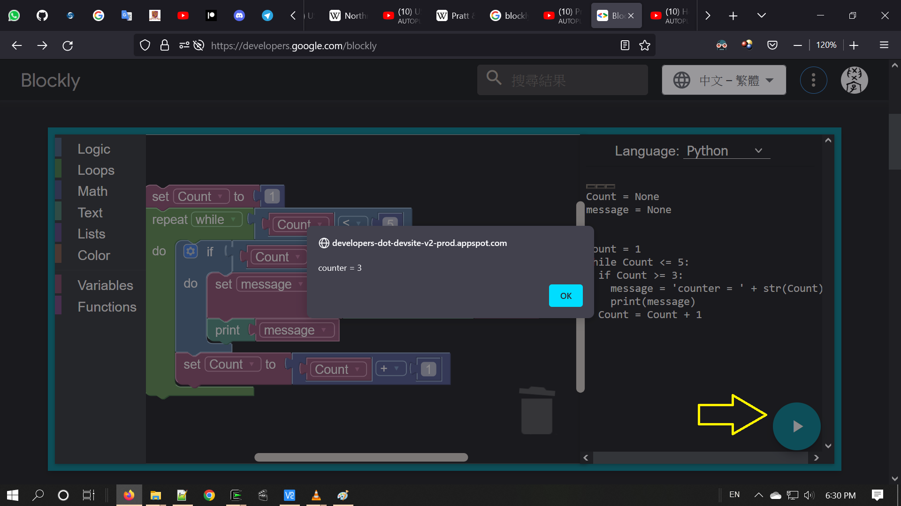

last update : 20221108_1920(UTC+8)   
  
prev update : 20221108_1842(UTC+8)  
  
---------------------------------------------  
  
Blockly  
  https://developers.google.com/blockly  
  
Print a Custom Message in Blockly / Learneroo /  Jun 9, 2015  
  https://youtu.be/MphESt4xhzg  
102 subscribers / 1,746 views   
Create and print a variable that combines user input with custom text.  
  
---------------------------------------------  

  

  

  

  

  

---------------------------------------------  
end of file
